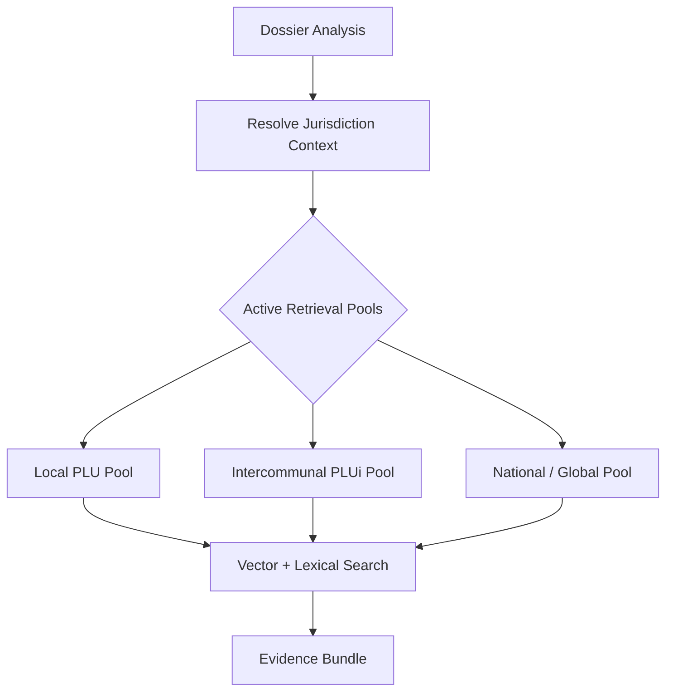

# HEUREKA Strict Jurisdiction Boundary Model

This document outlines the architecture for legal territory scoping and document pooling used to prevent cross-city data contamination in the HEUREKA platform.

## 1. Stable Identifier Architecture

HEUREKA moves away from fuzzy city names to robust, legal identifiers:

- **INSEE Code**: The 5-digit city identifier (e.g., `94052` for Nogent-sur-Marne).
- **Jurisdiction ID (EPCI)**: Stable ID for the intercommunal authority (e.g., `EPCI-NOGENT-PEUX`).
- **Pool ID**: A unique identifier for a collection of documents (e.g., `94052-PLU-ACTIVE-2026`).

## 2. Jurisdiction Context & Scoping Hierarchy

Before any AI retrieval occurs, the [Orchestrator](file:///Users/evideletang/Desktop/HEUREKA/apps/api/src/services/orchestrator.ts) resolves the `JurisdictionContext`. This defines the boundaries for the entire analysis.

## 3. Boundary Enforcement Rules

| Boundary | Logic | Purpose |
| :--- | :--- | :--- |
| **City Isolation**| Chunks must be in `active_pool_ids` for the INSEE. | Prevents City A results from appearing in City B analysis. |
| **Status Exclusion**| Retrieval filters for `status = 'active'`. | Excludes archived or draft regulations by default. |
| **Global Reach** | `HEUREKA-GLOBAL-NATIONAL` is always appended. | Ensures national regulations (RNU) are accessible everywhere. |
| **Intercommunal** | The `jurisdiction_id` (EPCI) pulls shared rules. | Supports PLUi documents shared across multiple cities. |

## 4. Metadata Model

All knowledge-base fragments are tagged with [Jurisdiction Metadata](file:///Users/evideletang/Desktop/HEUREKA/packages/ai-core/src/schemas/retrieval.ts):

- `pool_id`: Stable ID of the document collection.
- `jurisdiction_id`: Owning authority.
- `status`: `active`, `archived`, or `draft`.

## 5. Security & Contamination Safety

Boundary enforcement is validated by the [Jurisdiction Contamination Test](file:///Users/evideletang/Desktop/HEUREKA/packages/ai-core/src/jurisdiction_contamination.test.ts). Any retrieval that returns a chunk not belonging to the active pool or the global pool will trigger a failure, ensuring auditability and legal precision.
