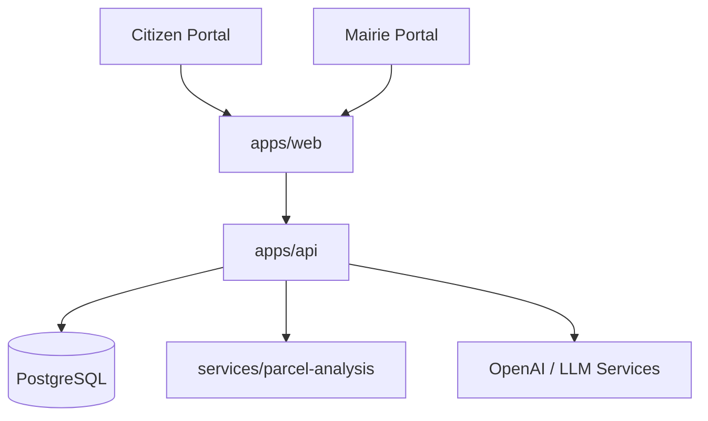

# Product Architecture - HEUREKA

HEUREKA is a monorepo-based platform for urban planning assistance and PLU conformity analysis.

## System Overview

The system consists of three main components:
1.  **Frontend (apps/web)**: A React/Vite application providing interactive portals for Citizens, Mairies, Métropoles, and ABF Experts.
2.  **API Gateway (apps/api)**: An Express-based backend that orchestrates business logic, authentication, and communication with specialized services.
3.  **Geospatial Analysis (services/parcel-analysis)**: A specialized service using Turf.js to analyze cadastral parcels and building geometries for PLU conformity checks.

## Key Technologies
- **Frontend**: React 19, Vite 7, Tailwind CSS 4, Framer Motion 12, Wouter (routing).
- **Backend / API**: Express 5, Node.js.
- **Database**: PostgreSQL (managed via Drizzle ORM).
- **Geospatial**: Turf.js, Leaflet.
- **Infrastructure**: Docker, pnpm Workspaces.

## Architecture Diagram (Simplified)

