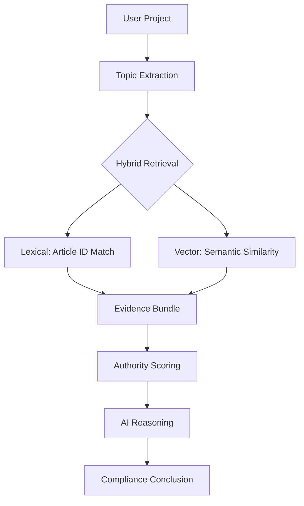

# HEUREKA Retrieval Accuracy Strategy

This document outlines the precision-focused retrieval architecture used to ensure all HEUREKA urbanism conclusions are grounded in authoritative legal sources.

## 1. Grounded Architecture Overview

The HEUREKA pipeline moves away from "fuzzy" semantic-only search to a **Hybrid, Article-Aware** model:

## 2. Smart Article-Aware Chunking

Traditional chunking by word count (e.g., 800 words) often splits legal articles mid-sentence. HEUREKA implements **Smart Article Detection**:
- **Strategy**: Splits on `Article X`, `Section Y`, or `Chapitre Z` boundaries.
- **Context Preservation**: Ensures that a rule and its exceptions (e.g., Article 10.1 and 10.2) stay in the same logical chunk.
- **Metadata**: Every chunk is tagged with its `article_id` for deterministic retrieval.

## 3. Hybrid Retrieval & Grounding Boost

To prevent the AI from "drifting" between similar articles:
1.  **Lexical Search**: SQL-level matching on `article_id`.
2.  **Vector Search**: Semantic match on vocabulary (e.g., "hauteur", "faitage").
3.  **The Grounding Boost**: If a chunk is an exact match for the targeted `article_id`, it receives a **+2.0 SCORE BOOST**, ensuring it outranks semantically similar but legally irrelevant fragments.

## 4. Authority-Aware Ranking

HEUREKA implements the [Authority Policy](file:///Users/evideletang/Desktop/HEUREKA/docs/EVIDENCE_RANKING.md) to bias the model towards binding regulations:
- **Rule**: (Similarity * 0.4) + (Authority * 0.6).
- **Result**: Even if a "Notice Descriptive" perfectly describes a project's height (high similarity), the "PLU Article 10" (lower similarity, but high authority) will be prioritized as the source of truth.

## 5. Structured Evidence Bundles

Instead of loose document dumps, the AI reasoning engine consumes structured **EvidenceBundles**:
- **Normalized Facts**: Project data from the CERFA.
- **Authoritative Rule**: The primary governing rule text.
- **Support Chunks**: Ranked fragments that add context.
- **Conflict Flags**: Detected contradictions between sources.
